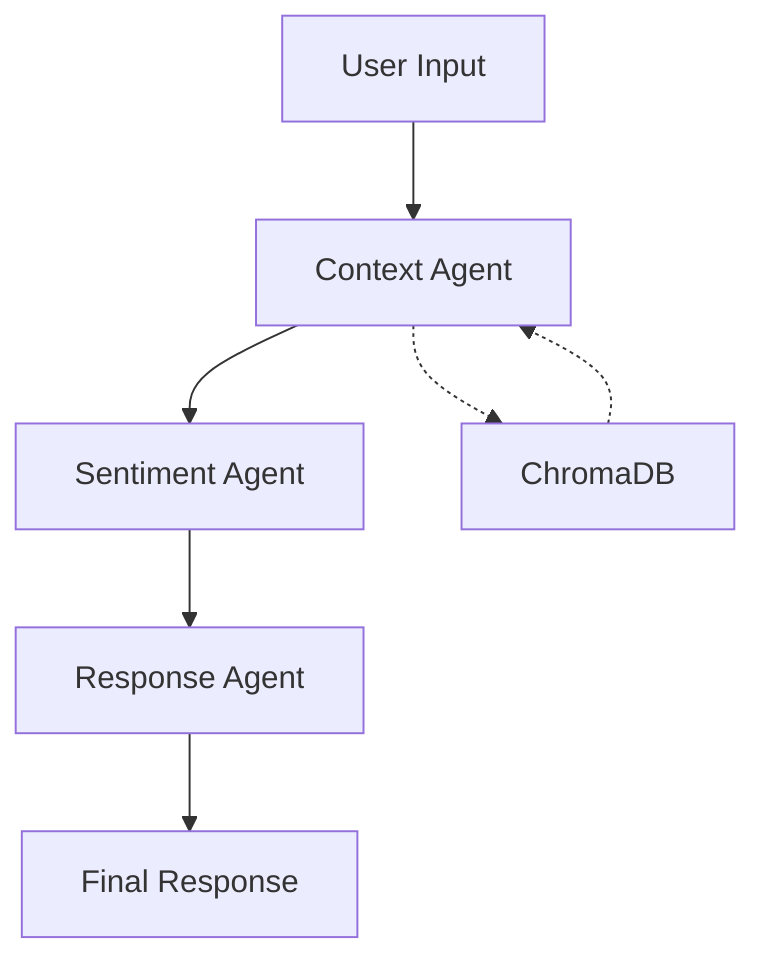

# 🇺🇸 AI Politician Chat System 🇺🇸

<p align="center">
  
  
  
</p>

The AI Politician chat system provides an interactive interface for conversing with AI versions of politicians. The system simulates the speaking style, policy positions, and personality of specific politicians (currently Joe Biden and Donald Trump).

---

## 📋 Table of Contents

- [System Architecture](#system-architecture)
- [How It Works](#how-it-works)
- [Chat Modes](#chat-modes)
- [Setup and Usage](#setup-and-usage)
- [Politician Speaking Styles](#politician-speaking-styles)
- [Technical Implementation](#technical-implementation)
  - [Models in Detail](#models-in-detail)
  - [RAG System Architecture](#rag-system-architecture)
- [Troubleshooting](#troubleshooting)
- [Example Prompts](#example-prompts)
- [Advanced Features](#advanced-features)

---

## 🏗️ System Architecture

The chat system is structured in multiple layers:

1. **Entry Points**: 
   - `aipolitician.py`: Main launcher script for all modes
   - Various helper scripts in the `scripts/` directory

2. **Core Components**:
   - **LangGraph System**: A workflow-based system that processes user input through multiple stages
   - **RAG System**: Retrieval-Augmented Generation for factual knowledge integration
   - **Response Models**: Fine-tuned Mistral-7B models with politician-specific adapters

3. **Processing Pipeline**:
   - **Context Agent**: Extracts topics and retrieves relevant knowledge
   - **Sentiment Agent**: Analyzes query sentiment and determines if deflection is needed
   - **Response Agent**: Generates the final politician response

---

## ⚙️ How It Works

When you chat with the AI Politician, the following process occurs:



1. Your input is received by the system
2. The **Context Agent**:
   - Identifies topics and policy areas in your question using **TinyLlama-1.1B-Chat**
   - Retrieves relevant facts from the ChromaDB database (if RAG is enabled)
   - Formats context information for the response generation

3. The **Sentiment Agent**:
   - Analyzes the sentiment of your question using **RoBERTa-base-sentiment**
   - Detects potential "gotcha" questions or personal attacks
   - Determines if the question should be deflected based on sentiment score

4. The **Response Agent**:
   - Loads the appropriate politician model (Biden or Trump)
   - Constructs a prompt with the context and sentiment analysis
   - Generates a response using the fine-tuned **Mistral-7B** with politician-specific adapters
   - Formats the response to match the politician's speaking style

---

## 💬 Chat Modes

The system offers three main chat modes:

### 1. Clean Chat Mode

Provides a standard conversational experience without technical details.

```bash
python aipolitician.py chat biden
# or
python aipolitician.py chat trump
```

### 2. Debug Mode

Shows the clean chat response plus debugging information such as sentiment analysis, knowledge retrieval status, and deflection status.

```bash
python aipolitician.py debug biden
# or
python aipolitician.py debug trump
```

### 3. Trace Mode

Displays detailed information about each step in the workflow process, showing how the system analyzes the query and generates a response.

```bash
python aipolitician.py trace biden
# or
python aipolitician.py trace trump
```

---

## 🚀 Setup and Usage

### Prerequisites

1. Python 3.9+ installed
2. CUDA-capable GPU (optional but recommended)
3. Appropriate Python packages installed

### Installation

1. Clone the repository:
   ```bash
   git clone [repository-url]
   cd aipolitician
   ```

2. Install dependencies:
   ```bash
   pip install -r requirements/requirements-chat.txt
   ```

<!-- 3. Set up the ChromaDB directory (for RAG):
   ```bash
   sudo mkdir -p /opt/chroma_db
   sudo chown $USER:$USER /opt/chroma_db
   ``` -->

### Running the Chat

#### Basic Usage

To start a chat with Biden:
```bash
python aipolitician.py chat biden
```

To start a chat with Trump:
```bash
python aipolitician.py chat trump
```

#### With Debugging Information

To see sentiment analysis and other debug details:
```bash
python aipolitician.py debug biden
```

#### With Detailed Tracing

To see the complete workflow execution:
```bash
python aipolitician.py trace biden
```

#### Without RAG

If you encounter issues with the RAG system or don't want to use factual retrieval:
```bash
python aipolitician.py chat biden --no-rag
```

---

## 🗣️ Politician Speaking Styles

### Joe Biden

Biden's responses are designed to mimic his authentic speaking style with:

- Verbal fillers like "Look, folks", "Here's the deal", "I'm not joking"
- Personal anecdotes about his family, Scranton, or his working-class upbringing
- Conversational, unstructured flow with natural pauses
- Occasional topic shifts that circle back to the main point
- References to the "soul of America" and "dignity"

### Donald Trump

Trump's responses feature his characteristic style including:

- Short, emphatic sentences
- Superlative language ("tremendous", "the best")
- Repetition for emphasis
- Direct, confrontational approach to criticism
- References to "Make America Great Again"

---

## 🔧 Technical Implementation

### Models in Detail

| Component | Model | Purpose | Technical Details |
|-----------|-------|---------|------------------|
| **Response Generation** | Mistral-7B-Instruct-v0.2 | Generate politician responses | <ul><li>7B parameter base model</li><li>LoRA adapters for each politician</li><li>4-bit quantization (QLoRA)</li><li>PEFT fine-tuning approach</li></ul> |
| **Context Extraction** | TinyLlama-1.1B-Chat-v1.0 | Identify topics & policy areas | <ul><li>1.1B parameter model</li><li>Optimized for low resource usage</li><li>Instruction-tuned variant</li></ul> |
| **Sentiment Analysis** | RoBERTa-base-sentiment | Detect question sentiment | <ul><li>Specialized for sentiment detection</li><li>Trained on Twitter data</li><li>3-way classification (positive/neutral/negative)</li></ul> |
| **RAG Embeddings** | all-MiniLM-L6-v2 | Create document vectors | <ul><li>384-dimensional embeddings</li><li>Sentence-Transformers architecture</li><li>Optimized for semantic search</li></ul> |

### RAG System Architecture

The Retrieval-Augmented Generation system provides factual knowledge to enhance responses:

#### 📊 Database Structure

```
ChromaDB (Persistent Client)
└── Collection: "politicians"
    ├── Documents (Political content)
    ├── Metadata (politician name, content type, source URL)
    └── Embeddings (384-dimensional vectors)
```

#### 🧠 Vector Search Details

- **Database Engine**: ChromaDB with SQLite backend
- **Storage Location**: `/opt/chroma_db` (persistent storage)
- **Collection Structure**:
  - Document ID format: `{politician_id}_entry_{idx}`
  - Metadata fields: `politician_name`, `content_type`, `source`
  - Vector dimensions: 384 (from all-MiniLM-L6-v2)

#### 🔍 RAG Query Process

1. **Query Preprocessing**:
   - User question is captured
   - Query text is sent to embedding model

2. **Vector Embedding**:
   - SentenceTransformer converts query to 384-dimensional vector
   - Embedding is formatted as a float array

3. **Similarity Search**:
   - ChromaDB performs vector similarity search using cosine distance
   - Query is filtered by politician name to ensure relevance
   - Top 5 most similar documents are retrieved

4. **Context Integration**:
   - Retrieved documents are formatted with source information
   - Context is added to the prompt for the response model
   - Response model generates answer influenced by retrieved facts

#### 🧩 Document Chunking Strategy

- Text documents are split into ~1000 character chunks during formatting
- Each chunk becomes a separate document in ChromaDB
- Chunking preserves paragraph boundaries where possible
- Chunks maintain sufficient context while optimizing for vector search

---

## ❓ Troubleshooting

### RAG Issues

If you see "RAG database system not available":
1. Ensure ChromaDB is installed: `pip install -r requirements/requirements-chat.txt`
2. Check that the DB directory exists: `/opt/chroma_db`
3. Try running with `--no-rag` flag to bypass the knowledge database


### Model Loading Issues

If models fail to load:
1. Check for proper CUDA installation
2. The system will use a fallback response generator
3. Try running on a machine with more GPU memory

---

## 💡 Example Prompts

Try these example queries to see the system in action:

1. "What's your vision for America's future?"
2. "How would you handle the situation at the southern border?"
3. "Tell me about your infrastructure plan"
4. "What do you think about your political opponent?"
5. "How are you addressing climate change?"
6. "Can you tell me about your family?"
7. "What are your thoughts on the economy?"

---

## 🛠️ Advanced Features


### Environment Variables

You can customize model paths with environment variables:
- `BIDEN_ADAPTER_PATH`: Path to Biden's model adapter (default: "nnat03/biden-mistral-adapter")
- `TRUMP_ADAPTER_PATH`: Path to Trump's model adapter (default: "nnat03/trump-mistral-adapter") 