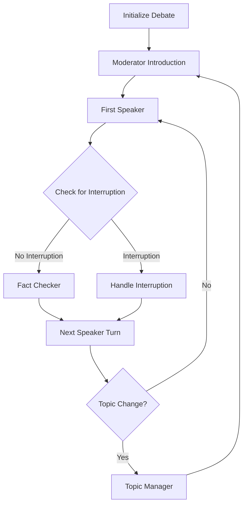

# 🎤 AI Politician Debate System 🎤

<p align="center">
  
  
  
</p>

The AI Politician Debate System simulates political debates between AI versions of politicians. The system orchestrates structured exchanges, manages topics, provides fact-checking, and creates a realistic debate experience.

---

## 📋 Table of Contents

- [System Architecture](#system-architecture)
- [How It Works](#how-it-works)
- [Debate Formats](#debate-formats)
- [Setup and Usage](#setup-and-usage)
- [Technical Implementation](#technical-implementation)
- [Troubleshooting](#troubleshooting)
- [Example Topics](#example-topics)
- [Advanced Features](#advanced-features)

---

## 🏗️ System Architecture

The debate system is built on these key components:

1. **LangGraph Workflow**:
   - A directed graph that manages the flow of the debate
   - Handles turn-taking, interruptions, and topic transitions
   - Provides fact-checking and moderator intervention

2. **Agent Roles**:
   - **Moderator**: Controls the debate, introduces topics, and ensures fair time allocation
   - **Debaters**: AI Politicians (Biden, Trump) who respond to topics and each other
   - **Fact Checker**: Verifies statements and provides corrections
   - **Topic Manager**: Selects and transitions between subtopics

3. **Integration**:
   - Uses the same politician models as the chat system
   - Incorporates RAG for factual grounding
   - Maintains consistent personality and style for each politician

---

## ⚙️ How It Works

The debate follows a structured workflow:



1. **Initialization**: The system configures the debate format, participants, and topic
2. **Introduction**: The moderator introduces the debate and first topic
3. **Speakers Take Turns**: Each politician speaks about the current topic
4. **Interruptions**: Politicians may interrupt each other based on statements
5. **Fact Checking**: Statements are verified for accuracy
6. **Topic Management**: The system transitions between subtopics
7. **Conclusion**: The moderator summarizes the debate after a set number of turns

---

## 💬 Debate Formats

The system supports multiple debate formats:

### 1. Head-to-Head

Direct debate between two politicians with equal speaking time.

```bash
python aipolitician.py debate --format head_to_head
```

### 2. Town Hall

Format with audience questions and longer response times.

```bash
python aipolitician.py debate --format town_hall
```

### 3. Panel

Multiple politicians discuss topics with a moderator.

```bash
python aipolitician.py debate --format panel
```

---

## 🚀 Setup and Usage

### Prerequisites

1. Python 3.9+ installed
2. CUDA-capable GPU (optional but recommended)
3. Appropriate Python packages installed

### Installation

1. Install the debate-specific dependencies:
   ```bash
   pip install -r requirements/requirements-debate.txt
   ```

2. Ensure the chat and RAG system dependencies are also installed:
   ```bash
   pip install -r requirements/requirements-chat.txt
   ```

### Running a Debate

#### Basic Usage

To start a default debate between Biden and Trump:
```bash
python aipolitician.py debate
```

#### With Specific Topic

To debate on a particular topic:
```bash
python aipolitician.py debate --topic "Climate Change"
```

#### With Specific Format

To use a particular debate format:
```bash
python aipolitician.py debate --format town_hall
```

#### With Opening Statements

To include opening statements:
```bash
python aipolitician.py debate --opening-statements
```

#### With Additional Options

```bash
python aipolitician.py debate --topic "Economy" --rounds 5 --moderator "Fox News" --fact-checking
```

---

## 🔧 Technical Implementation

### Components in Detail

| Component | Purpose | Implementation |
|-----------|---------|----------------|
| **Debate Graph** | Orchestrates the debate workflow | LangGraph StateGraph with conditional routing |
| **Moderator Agent** | Controls debate flow | Template-based with configurable styles (CNN, Fox News, etc.) |
| **Politician Agents** | Generate debate responses | Uses the fine-tuned politician models with context awareness |
| **Fact Checker** | Verifies factual claims | Combination of RAG lookup and model-based reasoning |
| **Topic Manager** | Handles topic transitions | Maintains debate coherence while covering multiple aspects |

### State Management

The debate system maintains a complex state that includes:
- Current speaker and speaking queue
- Turn history and debate context
- Fact check results
- Politician-specific states including positions and knowledge
- Interruption tracking
- Topic and subtopic management

### Debate Parameters

The system offers numerous configurable parameters:
- Number of debate rounds
- Moderator style and level of control
- Fact-checking frequency and threshold
- Interruption probability
- Speaking time per turn
- Topic depth and breadth

---

## ❓ Troubleshooting

### Common Issues

1. **Out of Memory Errors**:
   - Reduce the `--rounds` parameter
   - Use the `--no-fact-checking` flag to disable fact checking
   - Ensure you have a GPU with sufficient memory (min. 8GB recommended)

2. **Repetitive Responses**:
   - Try specifying different subtopics with `--subtopics "Economy, Jobs, Inflation"`
   - Use the `--temperature 0.8` flag to increase response variation

3. **Model Loading Errors**:
   - Ensure all requirements are installed
   - Check that you have the latest model versions
   - Try running with `--no-rag` to bypass knowledge retrieval

---

## 💡 Example Topics

Try these debate topics for engaging simulations:

1. "Climate Change and Energy Policy"
2. "Immigration and Border Security"
3. "Healthcare Reform"
4. "Economic Recovery and Inflation"
5. "Foreign Policy and International Relations"
6. "Gun Control and Second Amendment"
7. "Education and Student Loan Debt"

---

## 🛠️ Advanced Features

### Custom Moderators

You can specify different moderator styles:
```bash
python aipolitician.py debate --moderator "CNN" 
python aipolitician.py debate --moderator "Fox News"
python aipolitician.py debate --moderator "NPR"
```

### Debate Visualization

Generate a visual representation of the debate flow:
```bash
python aipolitician.py debate --visualize
```

### Saving Debate Transcripts

Save the entire debate transcript to a file:
```bash
python aipolitician.py debate --topic "Economy" --save-transcript
```

### Custom Politician Combinations

Although currently focused on Biden and Trump, the system architecture supports adding more politicians:
```bash
# Future functionality
python aipolitician.py debate --participants "biden,trump,sanders,harris"
```
