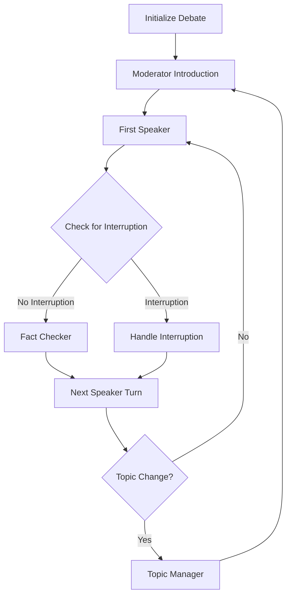

# 🎤 AI Politician Debate System 🎤

<p align="center">
  
  
  
</p>

The AI Politician Debate System simulates political debates between AI versions of politicians. The system orchestrates structured exchanges, manages topics, provides fact-checking, and creates a realistic debate experience.

---

## 📋 Table of Contents

- [System Architecture](#system-architecture)
- [How It Works](#how-it-works)
- [Debate Formats](#debate-formats)
- [Setup and Usage](#setup-and-usage)
- [Command Reference](#command-reference)
- [Technical Implementation](#technical-implementation)
- [Troubleshooting](#troubleshooting)
- [Example Topics](#example-topics)
- [Advanced Features](#advanced-features)

---

## 🏗️ System Architecture

The debate system is built on these key components:

1. **LangGraph Workflow**:
   - A directed graph that manages the flow of the debate
   - Handles turn-taking, interruptions, and topic transitions
   - Provides fact-checking and moderator intervention

2. **Agent Roles**:
   - **Moderator**: Controls the debate, introduces topics, and ensures fair time allocation
   - **Debaters**: AI Politicians (Biden, Trump) who respond to topics and each other
   - **Fact Checker**: Verifies statements and provides corrections
   - **Topic Manager**: Selects and transitions between subtopics

3. **Integration**:
   - Uses the same politician models as the chat system
   - Incorporates RAG for factual grounding
   - Maintains consistent personality and style for each politician

---

## ⚙️ How It Works

The debate follows a structured workflow:



1. **Initialization**: The system configures the debate format, participants, and topic
2. **Introduction**: The moderator introduces the debate and first topic
3. **Speakers Take Turns**: Each politician speaks about the current topic
4. **Interruptions**: Politicians may interrupt each other based on statements
5. **Fact Checking**: Statements are verified for accuracy
6. **Topic Management**: The system transitions between subtopics
7. **Conclusion**: The moderator summarizes the debate after a set number of turns

---

## 💬 Debate Formats

The system supports multiple debate formats:

### 1. Head-to-Head

Direct debate between two politicians with equal speaking time.

```bash
python aipolitician.py debate --format head_to_head --topic "Economy"
```

### 2. Town Hall

Format with audience questions and longer response times.

```bash
python aipolitician.py debate --format town_hall --topic "Healthcare"
```

### 3. Panel

Multiple politicians discuss topics with a moderator.

```bash
python aipolitician.py debate --format panel --topic "Foreign Policy"
```

---

## 🚀 Setup and Usage

### Prerequisites

1. Python 3.9+ installed
2. CUDA-capable GPU (optional but recommended)
3. Appropriate Python packages installed

### Installation

1. Install the debate-specific dependencies:
   ```bash
   pip install -r requirements/requirements-debate.txt
   ```

2. Ensure the chat and RAG system dependencies are also installed:
   ```bash
   pip install -r requirements/requirements-chat.txt
   ```

3. Set up the ChromaDB directory (for RAG):
   ```bash
   sudo mkdir -p /opt/chroma_db
   sudo chown $USER:$USER /opt/chroma_db
   ```

### Running a Debate

There are two ways to run the debate system:

#### 1. Using the Unified Launcher (Recommended)

The easiest way to run a debate is through the unified launcher:

```bash
# Basic debate with default settings
python aipolitician.py debate

# Debate with specific topic
python aipolitician.py debate --topic "Climate Change"

# Debate with specific format
python aipolitician.py debate --format "town_hall" 

# Debate without RAG
python aipolitician.py debate --no-rag
```

#### 2. Using the LangGraph Script Directly

For advanced use cases, you can use the LangGraph script directly:

```bash
python langgraph_politician.py debate run --topic "General" --participants "biden,trump"
```

---

## 📝 Command Reference

### Unified Launcher Command

```bash
python aipolitician.py debate [options]
```

### Unified Launcher Options

| Option | Description | Default |
|--------|-------------|---------|
| `--topic TEXT` | Main debate topic | "General Political Discussion" |
| `--format [town_hall\|head_to_head\|panel]` | Debate format | head_to_head |
| `--no-rag` | Disable RAG knowledge retrieval | False |

### Direct Script Command

```bash
python langgraph_politician.py debate [subcommand] [options]
```

### Direct Script Subcommands

- `run`: Run a debate with specified options
- `visualize`: Generate a visualization of the debate workflow
- `config`: Display configuration options

### Complete Run Options

| Option | Description | Default |
|--------|-------------|---------|
| `--topic TEXT` | Main debate topic | Required |
| `--participants TEXT` | Comma-separated politician identities | Required |
| `--format [town_hall\|head_to_head\|panel]` | Debate format | head_to_head |
| `--time-per-turn INTEGER` | Time in seconds per turn | 60 |
| `--allow-interruptions` | Enable interruptions | False |
| `--fact-check` | Enable fact checking | True |
| `--no-fact-check` | Disable fact checking | False |
| `--moderator-control [strict\|moderate\|minimal]` | Level of moderator control | moderate |
| `--no-rag` | Disable RAG knowledge retrieval | False |
| `--trace` | Show trace information | False |
| `--output FILENAME` | Save transcript to JSON file | None |

---

## 🔧 Technical Implementation

### Technologies Used

| Component | Technology | Details |
|-----------|------------|---------|
| **Workflow Engine** | LangGraph | Orchestrates the multi-agent debate system |
| **Base Models** | Mistral-7B-Instruct-v0.2 | Powers the politician and fact-checker agents |
| **Fine-tuning** | QLoRA | Low-rank adaptation for politician-specific responses |
| **Embeddings** | SentenceTransformer | Used for knowledge retrieval and semantic similarity |
| **Vector DB** | ChromaDB | Stores and retrieves factual information |
| **Schema Validation** | Pydantic | Ensures proper data structures throughout the system |
| **Visualization** | NetworkX | Creates graphical representation of the debate workflow |

### Components in Detail

| Component | Purpose | Implementation |
|-----------|---------|----------------|
| **Debate Graph** | Orchestrates the debate workflow | LangGraph StateGraph with conditional routing |
| **Moderator Agent** | Controls debate flow | Template-based with configurable styles |
| **Politician Agents** | Generate debate responses | Uses the fine-tuned politician models with context awareness |
| **Fact Checker** | Verifies factual claims | Combination of RAG lookup and model-based reasoning |
| **Topic Manager** | Handles topic transitions | Maintains debate coherence while covering multiple aspects |

### State Management

The debate system maintains a complex state that includes:
- Current speaker and speaking queue
- Turn history and debate context
- Fact check results
- Politician-specific states including positions and knowledge
- Interruption tracking
- Topic and subtopic management

### Key Files

```
aipolitician.py                        # Main launcher script with debate support
langgraph_politician.py                # Advanced debate command entry point
scripts/debate/
├── debate_politician.py               # Debate script for standard mode
├── debug_debate.py                    # Debate script with debugging
└── test_debate_simple.py              # Simple test script without dependencies
src/models/langgraph/debate/
├── cli.py                             # Command-line interface
├── workflow.py                        # Debate workflow definition
├── agents.py                          # Agent implementations
└── README.md                          # Implementation notes
```

---

## ❓ Troubleshooting

### Common Issues

1. **Out of Memory Errors**:
   - Reduce the `--time-per-turn` parameter
   - Use the `--no-fact-check` flag to disable fact checking
   - Ensure you have a GPU with sufficient memory (min. 8GB recommended)

2. **Repetitive Responses**:
   - Try changing the topic to something more specific
   - Use more contentious topics that encourage disagreement
   - Ensure RAG system is working properly for factual grounding

3. **Model Loading Errors**:
   - Ensure all requirements are installed
   - Check that you have the latest model versions
   - Try running with `--no-rag` to bypass knowledge retrieval

4. **Incorrect Command Syntax**:
   - For simple usage, use `python aipolitician.py debate`
   - For advanced options, use `python langgraph_politician.py debate run`
   - Ensure you specify required arguments for the direct script approach

---

## 💡 Example Topics

Try these debate topics for engaging simulations:

1. "Climate Change and Energy Policy"
2. "Immigration and Border Security"
3. "Healthcare Reform"
4. "Economic Recovery and Inflation"
5. "Foreign Policy and International Relations"
6. "Gun Control and Second Amendment"
7. "Education and Student Loan Debt"

Sample command:
```bash
python aipolitician.py debate --topic "Climate Change and Energy Policy"
```

---

## 🛠️ Advanced Features

### Testing Without Dependencies

For a quick test of the debate system without loading models:
```bash
python scripts/debate/test_debate_simple.py
```

### Saving Debate Transcripts

Save the entire debate transcript to a file (advanced usage only):
```bash
python langgraph_politician.py debate run --topic "Economy" --participants "biden,trump" --output "economy_debate.json"
```

### Moderator Control Levels

You can specify different levels of moderator control (advanced usage only):
```bash
# Strict moderator (keeps debate focused, minimal interruptions)
python langgraph_politician.py debate run --topic "Healthcare" --participants "biden,trump" --moderator-control strict
```

### Workflow Visualization

Generate a visual representation of the debate flow:
```bash
python langgraph_politician.py debate visualize
```

### Future Extensions

The debate system architecture is designed to be extensible:
- Add more politicians beyond Biden and Trump
- Implement different moderator personalities
- Create custom debate formats
- Support audience participation and questions
