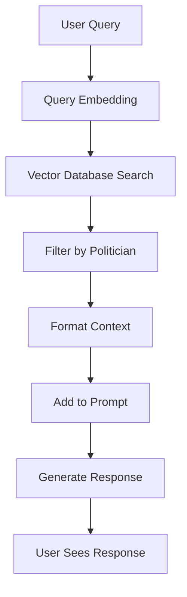

# 🔍 AI Politician RAG System 🔍

<p align="center">
  
  
  
</p>

The Retrieval-Augmented Generation (RAG) system enhances the AI Politician's responses by retrieving relevant factual information from a vector database before generating responses. This makes both chat and debate interactions more accurate and grounded in real-world knowledge.

---

## 📋 Table of Contents

- [System Architecture](#system-architecture)
- [How It Works](#how-it-works)
- [Setup and Usage](#setup-and-usage)
- [Integration with Chat & Debate](#integration-with-chat--debate)
- [Technical Implementation](#technical-implementation)
- [Troubleshooting](#troubleshooting)
- [Advanced Features](#advanced-features)
- [Customization](#customization)

---

## 🏗️ System Architecture

The RAG system consists of these key components:

1. **Vector Database**:
   - **ChromaDB**: Stores and retrieves document embeddings
   - **PersistentClient**: Maintains data across sessions with SQLite backend
   - **Collection**: `politicians` - contains document chunks and their embeddings

2. **Embedding Pipeline**:
   - **SentenceTransformer**: Creates vector representations of both queries and documents
   - **Embedding Model**: `sentence-transformers/all-MiniLM-L6-v2` (384-dimensional vectors)
   - **Query Processing**: Transforms user queries into searchable vectors

3. **Integration Layer**:
   - **RAG Utilities**: Connects the database to the chat and debate workflows
   - **Context Formatting**: Structures retrieved documents for model prompts
   - **Politician Filtering**: Retrieves only relevant information for specific politicians

---

## ⚙️ How It Works

The RAG system follows this process flow when retrieving knowledge:



1. **Query Processing**:
   - User question is analyzed for topic and intent
   - The query is embedded into a vector representation

2. **Knowledge Retrieval**:
   - ChromaDB searches for semantically similar documents
   - Results are filtered by politician identity for relevance
   - Documents are ranked by similarity score

3. **Context Integration**:
   - Retrieved documents are formatted into a context string
   - The context provides factual grounding for responses
   - Information is structured for optimal model usage

4. **Response Generation**:
   - The model generates a response using both query and retrieved context
   - Responses reflect factual knowledge while maintaining politician's style
   - The result is a factually-grounded yet authentic-sounding response

---

## 🚀 Setup and Usage

### Prerequisites

1. Python 3.9+ installed
2. 500MB disk space for database storage
3. Appropriate Python packages installed

### Installation

1. Install RAG system dependencies:
   ```bash
   pip install -r requirements/requirements-rag.txt
   ```

2. Set up the ChromaDB directory:
   ```bash
   sudo mkdir -p /opt/chroma_db
   sudo chown $USER:$USER /opt/chroma_db
   ```

3. Ensure the system can download embedding models (internet connection required for first run)

### Using the RAG System

The RAG system integrates automatically with both chat and debate functions:

#### In Chat Mode

```bash
# With RAG enabled (default)
python aipolitician.py chat biden

# With RAG specifically disabled
python aipolitician.py chat biden --no-rag
```

#### In Debate Mode

```bash
# With RAG enabled (default)
python aipolitician.py debate --topic "Climate Change"

# With RAG specifically disabled
python aipolitician.py debate --topic "Climate Change" --no-rag
```

---

## 🔄 Integration with Chat & Debate

### Chat System Integration

The RAG system provides factual knowledge to the chat workflow:

- The Context Agent calls RAG to retrieve relevant knowledge about the query topic
- Retrieved content is formatted and added to the politician's context
- This allows the politician to reference real facts while maintaining their characteristic style

### Debate System Integration

In debates, the RAG system provides knowledge to multiple politicians:

- Knowledge is retrieved for each politician on the debate topic
- Each debater gets their own context tailored to their perspective
- The fact-checking process also uses RAG to verify factual claims
- Subtopics benefit from specific knowledge retrieval as the debate progresses

---

## 🧠 Technical Implementation

### Database Structure

| Component | Details |
|-----------|---------|
| **Type** | Persistent ChromaDB with SQLite backend |
| **Location** | `/opt/chroma_db` |
| **Collection** | `politicians` |
| **Document Format** | Text chunks with metadata (source, politician, topic) |
| **Embedding Size** | 384 dimensions per vector |
| **Similarity Method** | Cosine similarity |

### Query Pipeline

1. **Preprocessing**: Clean and prepare user query
2. **Embedding**: Convert to vector using SentenceTransformer
3. **Retrieval**: Find similar vectors with distance measurement
4. **Filtering**: Apply metadata filters for politician-specific content
5. **Ranking**: Sort by relevance score
6. **Selection**: Choose top N most relevant chunks
7. **Formatting**: Format for inclusion in prompt

### Performance Considerations

- **Speed**: Typical retrieval completes in <100ms
- **Accuracy**: Semantic matching outperforms keyword search
- **Memory**: ~500MB for database with full politician knowledge
- **Scaling**: Database can handle thousands of documents efficiently

---

## ❓ Troubleshooting

### Verifying RAG Status

When RAG is working correctly, you'll see this message when starting the application:
```
RAG database system available and operational.
```

You can also verify RAG is working by checking if responses contain specific factual details that weren't in your query.

### Common Issues and Solutions

| Issue | Symptom | Solution |
|-------|---------|----------|
| **ChromaDB Not Installed** | "RAG database system not available: ChromaDB not installed" | Run `pip install -r requirements/requirements-rag.txt` |
| **SentenceTransformer Missing** | "SentenceTransformer not installed" | Run `pip install -r requirements/requirements-rag.txt` |
| **Database Path Issues** | "Database path /opt/chroma_db does not exist" | Create directory: `sudo mkdir -p /opt/chroma_db && sudo chown $USER:$USER /opt/chroma_db` |
| **Missing Collection** | "Politicians collection not found in database" | The database needs to be populated with politician data |
| **Embedding Errors** | "Failed to generate embeddings" | Check internet connection for model download or CPU/RAM resources |

### Bypassing RAG

If you're having persistent issues, you can bypass the RAG system with the `--no-rag` flag:
```bash
python aipolitician.py chat biden --no-rag
python aipolitician.py debate --no-rag
```

---

## 🛠️ Advanced Features

### Initializing the Database

To initialize the database with custom content:

```bash
python scripts/data/initialize_database.py --source path/to/documents/
```

### Viewing Database Statistics

To see how many documents are in the database and their distribution:

```bash
python scripts/data/view_database_stats.py
```

### Testing Retrieval Quality

Test how well the system retrieves relevant documents for a given query:

```bash
python scripts/data/test_retrieval.py --query "What is Biden's position on climate change?"
```

---

## 🧩 Customization

### Adding Custom Knowledge

You can expand the knowledge base with custom documents:

1. Prepare text files with relevant information
2. Use the document processing scripts in `scripts/data/` to chunk and format
3. Add to the database using the embedding utilities

### Adjusting Retrieval Parameters

Fine-tune how the system retrieves documents:

- **Number of Results**: Change how many documents are retrieved per query
- **Similarity Threshold**: Adjust minimum similarity score for inclusion
- **Chunk Size**: Change how documents are split before embedding

### Using Alternative Embedding Models

You can use different embedding models based on your requirements:

- Smaller models for faster retrieval but less accuracy
- Larger models for better semantic understanding but slower processing
- Specialized models for specific domains 